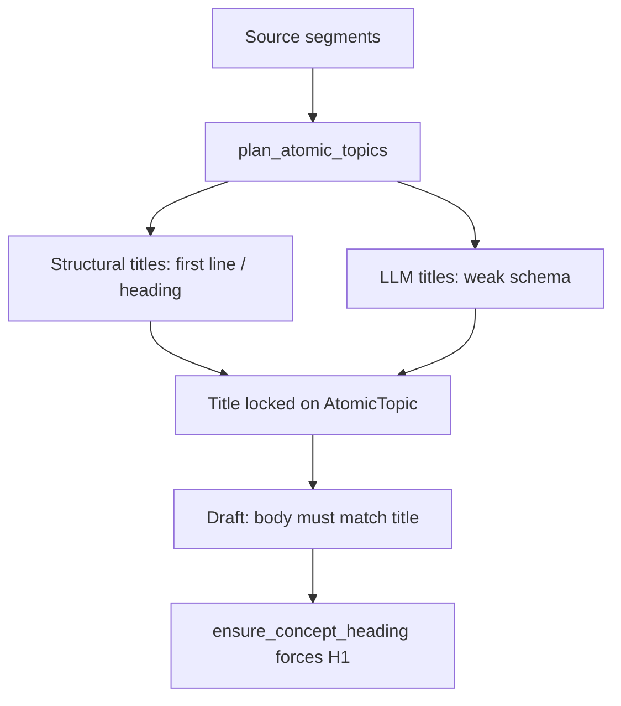

# Body-grounded topic title algorithm

## Diagnosis (why titles feel choppy / disconnected)

Topic titles are chosen **before** the note body is written, then drafting is constrained to match them (`ATOMIC_NOTE_RULES`: “body must match the given title”; [`ensure_concept_heading`](app/summarize.py) overwrites the H1).

Current title sources:

| Path | Mechanism | Failure mode |
|------|-----------|--------------|
| Structural (no heading) | [`title_from_text`](app/text_utils.py) = first non-empty line, truncated to 72 chars | PDF line fragments, lead-ins, mid-sentence wraps → choppy titles |
| Structural (heading split) | Markdown heading kept even after oversized split | Part 1 keeps parent heading while body is only one paragraph of that section → title≠body |
| Structural (split part 2+) | Re-derive via `title_from_text` | Still first-line, not the concept |
| LLM planning | [`topic_planning_prompt`](app/prompts.py): `"title": short concept title` with almost no title quality rules | Sentence fragments, generic labels, titles not entailed by `summary` |
| Draft | [`compose_title`](app/summarize.py) only normalizes punctuation/numbering | Cannot recover a wrong concept |

There is already good extractive machinery in [`app/summarize.py`](app/summarize.py) (`_score_sentences`, `summarize_text`, `key_points`) used for **bodies**, but titles never use it.

## Architecture amendments (planning notes)

Keep the draft’s **planning-time / extractive-only** design. Adjust ownership and seams so this change does not grow hotspots or leave stale plan caches:

| Decision | Draft | Amended |
|----------|-------|---------|
| Module home | `app/summarize.py` | **`app/titling.py`** — distinct policy from extractive bodies; `compose_title` stays in `summarize` (or thin re-export) |
| Integration style | Replace `title_from_text` call sites | **Single chokepoint** `refine_topic_title(body, *, hint=None)` used by `_atomic_topic`, splits, and LLM post-parse |
| Path uniqueness | `(part N)` inside `_title_for_split_part` | **`disambiguate_titles(titles)`** after grounding — naming ≠ collision policy |
| Plan reuse | Implicit on new runs | Bump [`analysis_fingerprint`](app/suggest/plan.py) with `TITLE_ALGORITHM_VERSION` so upgrades invalidate cached plans |
| Tunables | Inline magic numbers | `TextLimits` / `TitlingLimits` (word band, heading Jaccard, coherence floor) |
| Success metric | Fewer `heading_mismatch` | Also optional **`title_ungrounded`** in [`note_intelligence`](app/note_intelligence.py) (H1 match is already forced) |

**Public surface (`app/titling.py`):**

- `TITLE_ALGORITHM_VERSION`
- `concept_title_from_body(body, *, hint=None) -> str`
- `title_body_coherence(title, body) -> float`
- `refine_topic_title(body, *, hint=None) -> str`
- `disambiguate_titles(titles: list[str]) -> list[str]`

`title_from_text` remains in [`text_utils.py`](app/text_utils.py) for non-topic “first line” needs; **topic naming must not call it**.

**Phased delivery:** (0) module + unit goldens → (1) structural wire → (2) LLM repair → (3) fingerprint + quality flag. Offline structural path ships value without LLM.

## Proposed algorithm: body-grounded concept titling

**Design choice:** Refine titles at **planning time** (before draft), so the existing “body matches title” constraint becomes a quality lever rather than a source of drift. Do not retitle after draft (avoids breaking resume identity keyed on `(segment_indices, composed title)` in [`draft.py`](app/suggest/draft.py)).

### Core function: `concept_title_from_body(body, *, hint=None) -> str`

New home: [`app/titling.py`](app/titling.py). Reuses extractive helpers from [`app/summarize.py`](app/summarize.py) (`_score_sentences`, `summarize_text`) and presentation normalize via `compose_title`. Replaces topic-naming call sites of `title_from_text`.

**Step 1 — Clean**
- Run `clean_extractive_text(body)`.
- Drop boilerplate via existing [`is_boilerplate_title`](app/relevance.py) / low-value checks where applicable.

**Step 2 — Candidate generation** (cheap, no LLM)
1. **Aligned heading:** If `hint` or an in-body `#`/`##`/`###` heading exists, keep it only when content-word overlap with the body meets a threshold (e.g. Jaccard ≥ ~0.25 on content words). Otherwise discard inherited headings.
2. **Definitional patterns** from top-scoring sentences (reuse `_score_sentences`):
   - `X is/are a/an/the …`, `X refers to …`, `X means …` → candidate `X` (or short `X …` if X alone is too generic).
3. **Concept phrase from best sentence:** Strip discourse openers (`However,`, `In this section,`, `As shown in Figure N,`), take a 3–8 word noun-ish span (leading capitalized / content-word window), not a full clause.
4. **Salient n-gram fallback:** Top content-word bigram/trigram from the body, Title-Cased.
5. Optional `hint` retained only if it passes the coherence gate below.

**Step 3 — Score & select**
Score each candidate on:
- Body grounding (content-word overlap with body / summary)
- Length sweet spot (≈3–8 words; penalize 1-word generics and >12-word clauses)
- Completeness (penalize trailing conjunctions/prepositions, ellipses, ToC page numbers)
- Not boilerplate (`is_boilerplate_title`)

Return `compose_title(best)`.

**Step 4 — Coherence gate**
If best score is below threshold, fall back to: `compose_title(summarize_text(body, max_sentences=1))` clipped to a phrase (first clause / first 8 content words), never raw first-line truncation alone.

### Integration points

1. **Structural planning** — [`app/atomic_notes.py`](app/atomic_notes.py)
   - Prefer wiring through `_atomic_topic` / `refine_topic_title` so every birth path is covered.
   - `_split_segment_by_heading`: preamble / no-heading paths ground from body; heading-backed topics pass heading as `hint` (drop if misaligned).
   - Oversized splits: **always** title from chunk body (including part 1). Remove “part 1 keeps section heading”.
   - After a split batch (or full structural plan), run `disambiguate_titles` so `(part N)` is only a collision suffix, not part of concept selection.

2. **LLM planning** — [`app/prompts.py`](app/prompts.py) + post-parse in [`_llm_plan_topics`](app/atomic_notes.py)
   - Extend `TOPIC_PLANNING_RULES` / schema text:
     - Title = noun phrase naming one concept (3–8 words)
     - Not a sentence fragment; no page numbers / ellipsis
     - Must be entailed by the item’s `summary` (write summary first mentally; title names that concept)
   - After parse: same coherence gate on `(title, summary or segment text)`; if it fails, `refine_topic_title(segment_text, hint=llm_title)`.

3. **Plan fingerprint** — [`app/suggest/plan.py`](app/suggest/plan.py)
   - Include `TITLE_ALGORITHM_VERSION` in `analysis_fingerprint` shaping settings so algorithm upgrades invalidate reused checkpoint plans.

4. **Draft path** — unchanged: `compose_title(topic.title)` + `ensure_concept_heading`; no post-draft retitle.

5. **Deprecate topic use of** `title_from_text` for naming (keep for non-topic first-line needs only).

### Constraints to preserve

- Full segment coverage via structural reconcile; atomic size caps; offline/budget fallback with no extra LLM calls for titles.
- Emit the same `AtomicTopic(title, segments, summary, is_novel)` shape; draft still uses `compose_title` + `ensure_concept_heading`.
- Resume identity stays `(segment_indices, composed title)` — titles change only at planning time for new runs (filenames/slugs improve as a side effect). Mid-run resume of an *old* incomplete checkpoint keeps its saved titles; fresh Analyze after the version bump re-plans.

### Success criteria (qualitative + tests)

- Titles read as concept names (“Learning rate schedules”), not truncated sentences (“When the step size is too lar…”).
- After paragraph/sentence splits, each part’s title reflects **that chunk’s** dominant concept, not the parent section.
- LLM titles that are vague or ungrounded are repaired deterministically without an extra LLM call.
- Existing resume/checkpoint identity behavior unchanged except when titles improve (expected: different slugs for newly planned runs).
- Quality: optional `title_ungrounded` from shared coherence helper; do not rely on `heading_mismatch` alone (H1 is forced to match `concept_title`).

### Tests to add

- [`tests/test_titling.py`](tests/test_titling.py): definitional → short concept; misaligned heading discarded; choppy first-line loses; coherence gate thresholds (prefer “title family” asserts over brittle exact n-grams).
- Invert [`test_title_for_split_part_keeps_heading_on_part_one`](tests/test_concept_alignment.py) — part 1 must ground from body when it diverges from the parent heading.
- Planning test: mock LLM title that fails coherence → repaired from segment body.
- Fingerprint test: changing `TITLE_ALGORITHM_VERSION` changes `analysis_fingerprint`.
- Update smoke asserts in [`scripts/smoke_test.py`](scripts/smoke_test.py) / [`tests/test_relevance.py`](tests/test_relevance.py) as needed.

### Out of scope

- Post-draft title rewriting / path renames mid-run
- Changing novelty, chunking, or draft body prompts beyond title rules
- New LLM calls solely for titling (repair is extractive)
