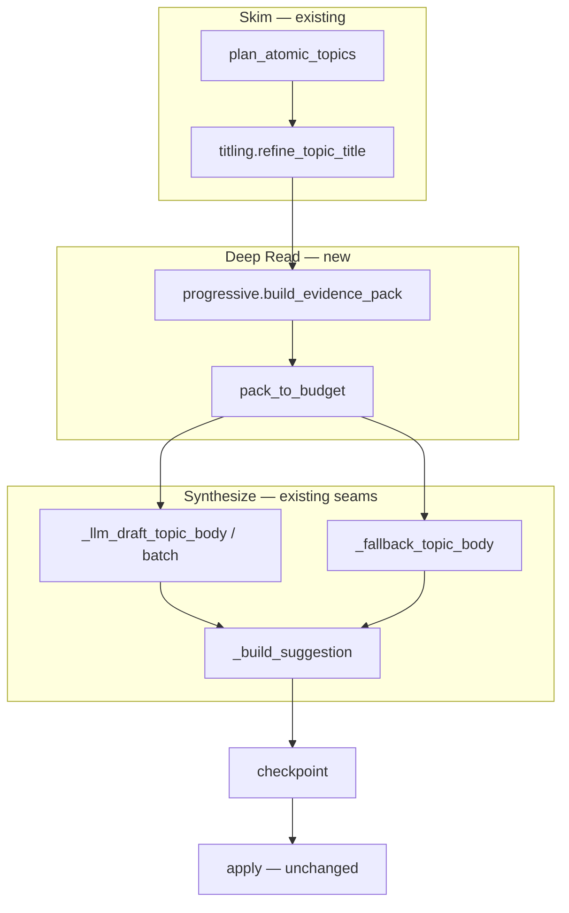
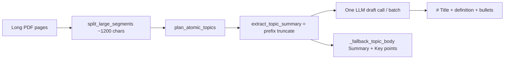

# Progressive draft pipeline (Skim → Deep Read → Synthesize)

## Architecture fit (current system)

Maps onto **Pipeline B** after the `suggest/` package split and shipped [`app/titling.py`](app/titling.py). No change to plan identity, apply, or vault writes.

| Stage | Role | Lives in today’s architecture |
|-------|------|-------------------------------|
| **Skim** | Orient + choose what matters | Already: `plan_atomic_topics` / planner `title`+`summary` + locations; titles grounded by `titling.py` |
| **Deep Read** | Select evidence under char budget | **New:** extractive `EvidencePack` in [`app/progressive.py`](app/progressive.py) (not inline in `draft.py`) |
| **Synthesize** | Write the atomic note | Existing: `_llm_draft_topic_body` / batch / `_fallback_topic_body` in [`app/suggest/draft.py`](app/suggest/draft.py) |
| **Progressive Summarization** | Layered compression format | L3→L2→L1 in the pack; light `>` + bold nuclei in note body; L0 stays Source |



**Module precedent:** follow `titling.py` — dedicated policy module + thin wire into the hotspot (`draft.py` ~1.3k lines). Do **not** grow `summarize.py` with packing policy; reuse its scorers.

**Public surface (`app/progressive.py`):**

- `EVIDENCE_PACK_VERSION`
- `EvidencePack` (`l3_executive`, `l2_essentials`, `l1_salient`, `media_hints`)
- `build_evidence_pack(topic_text, *, planner_summary=None, title=None, media_hints=None)`
- `pack_to_budget(pack, max_chars) -> EvidencePack`
- `format_for_prompt(pack) -> str`
- `render_progressive_note(title, pack) -> str`

**Wire only these draft sites** (replace prefix `extract_topic_summary`):

1. `_llm_draft_topic_body`
2. `_batch_draft_payload` (name today’s magic `700` as `TEXT_LIMITS.batch_draft_excerpt_chars`)
3. `_fallback_topic_body` → `render_progressive_note` so LLM and offline share shape

**Preserve:**

- Zero extra LLM calls on the default path (`LLMBudget` shared with planning)
- Batch fit via `_largest_batch_that_fits`; batch miss → extractive only
- Resume `(segment_indices, composed title)` — **no** `analysis_fingerprint` bump (draft-only)
- `wrap_untrusted` around all evidence layers in prompts
- Domain packs still append via `selected_domain_rules()`

**Out of first slice:** gated LLM Deep Read (`DRAFT_LLM_DEEP_READ`); PDF OCR availability.

**Ship docs:** add EvidencePack to ARCHITECTURE §7 (note-generation) and §17 (extension points).

---

## How drafting works today



Critical path in [`app/suggest/draft.py`](app/suggest/draft.py):

- Single-note: `extract_topic_summary(..., max_chars=2000)` then [`note_draft_prompt`](app/prompts.py)
- Batch: same helper capped at **700** chars per topic (`min(700, note_draft_excerpt_chars)`)
- Planner `summary` is prepended when present, but the “Source excerpt” is still a **naive prefix** of concatenated segments — not the most important passages
- Offline path: [`_fallback_topic_body`](app/suggest/draft.py) uses frequency-scored `summarize_text` / `key_points` (closest existing piece to progressive compression) then flattens to `## Summary` + `## Key points`
- Budget: default `LLM_MAX_CALLS_PER_RUN=50`, `LLM_MAX_INPUT_CHARS_PER_RUN=400_000` — a second LLM pass per note would burn the budget on large PDFs

So the product already **plans** (weak skim) and **synthesizes** (one-shot), but never **deep-reads**: long technical material past the first ~700–2000 characters of a topic is invisible to the writer.

Asymmetry: **extractive fallback already scores the full topic text**, while the LLM path only sees the prefix. Progressive packing closes that gap for the LLM without a second call. Tables/figures stay out of the draft prompt today (appended post-draft via `media_for_location`); captions can feed `media_hints` in the pack later.

There is no Progressive Summarization structure today (no layered compression artifact, no bold/highlight affordances in notes).

## Target mental model

Map the reading pipeline onto existing stages; use Progressive Summarization as the **compression format** between stages:

| Stage | Role | Implementation choice |
|-------|------|------------------------|
| **Skim** | Orient + choose what matters | Reuse planner `title` + `summary` + source headings/locations; cheap local outline of full topic text inside the packer |
| **Deep Read** | Select evidence under a char budget | New extractive packer: score full topic text, keep definitions / claims / numbers / conclusions — not the prefix |
| **Synthesize** | Write the atomic note | Draft LLM (or extractive fallback) consumes layered evidence, not raw prefix |
| **Progressive Summarization** | Layered compression | L3 executive → L2 essentials → L1 salient sentences (L0 full text stays local / in Source) |

**Default cost posture:** Deep Read is **extractive** (no extra LLM call). An optional gated LLM “claims” pass can come later for novel topics only; not required for the first ship.

## Proposed design

### 1. `EvidencePack` — progressive layers from full topic text

New module: [`app/progressive.py`](app/progressive.py) (reuse scorers from [`app/summarize.py`](app/summarize.py); optional coherence overlap with [`app/titling.py`](app/titling.py) for L3 planner-summary gate).

```text
EvidencePack:
  l3_executive: str      # 2–3 sentences (planner summary if grounded, else summarize_text)
  l2_essentials: list[str]  # 3–7 short bullets / highlighted claims
  l1_salient: list[str]     # 4–10 scored sentences/paragraphs with location hints
  media_hints: ...          # optional captions already available via media_for_location
```

Build from `combine_segment_text(topic.segments)` (full body), then **pack to budget**:

- Single draft budget ≈ `TEXT_LIMITS.note_draft_excerpt_chars` (2000)
- Batch budget ≈ `TEXT_LIMITS.batch_draft_excerpt_chars` (replace magic 700)

Packing priority (Deep Read):

1. Definitional / “X is …” sentences
2. Sentences with numbers, named methods, constraints, “however/limitation”
3. Section-final / conclusion-like sentences
4. Remaining high `_score_sentences` items  
Never rely on “first N characters” alone.

Skim inputs folded into L3: grounded planner `summary` wins when it overlaps the body; otherwise replace with extractive L3.

### 2. Wire drafting to the pack

Replace prefix `extract_topic_summary` in:

- `_llm_draft_topic_body`
- `_batch_draft_payload` / batch draft path
- `_fallback_topic_body` (consume the same pack so LLM and offline notes share structure)

Prompt change in [`app/prompts.py`](app/prompts.py): pass structured blocks via `format_for_prompt(pack)` (still fenced with `wrap_untrusted`), e.g.

```text
Executive summary (use as concept spine):
...
Essential claims (must be reflected if supported):
- ...
Salient source passages (quote or paraphrase; do not invent beyond these):
- ...
```

Tighten `ATOMIC_NOTE_RULES` slightly:

- Prefer paraphrase of essentials over copying long passages
- Preserve technical terms, quantities, and caveats from the essentials list
- Keep notes compact (`max_note_lines`)

### 3. Progressive Summarization in the written note (light)

Shape synthesize output (LLM instructions + `render_progressive_note`) as Forte-compatible layers without heavy UI work:

```markdown
# {title}

> {l3_executive}

{1 short definition paragraph}

## Key points
- **{bold nucleus}** — supporting clause from L2/L1
- ...

## Related notes
## Source
```

Rules:

- Blockquote = L3 only (not a dump of the PDF)
- Bold = progressive layer-1 affordance inside bullets (nucleus phrase), not whole-sentence bold spam
- Do **not** embed full L0 source in the note (Source section + location already provide checkability)
- Keep `ensure_concept_heading` / frontmatter / media / Related behavior unchanged

### 4. Optional later: LLM Deep Read (gated)

Only after extractive packing ships. Behind something like `DRAFT_LLM_DEEP_READ=false` by default:

- For `topic.is_novel` and `budget.remaining_calls` comfortable, one JSON call: extract `{claims, terms, caveats}` from a larger packed excerpt
- Then synthesize from that JSON + L3
- Hard skip when batching or budget low

Out of scope for the first implementation slice.

## Constraints to respect

- No vault writes in the draft path; apply flow unchanged
- Budget: default path must not add a call per note (`llm_max_calls_per_run=50` shared with planning)
- Batch drafting must keep working; packed evidence must fit `_largest_batch_that_fits` / char budget
- Cost policy: batch miss → extractive only (no per-note LLM retry); optional LLM deep-read must not fight this — skip when `llm_draft_batch_size > 1`
- Offline / exhausted budget / rate-limit disable → same `EvidencePack` → extractive progressive note
- Domain packs (`prompts/domains/*.json`) still append via `selected_domain_rules()`
- Checkpoint/resume identity remains `(segment_indices, composed title)` — drafting body changes only; **no** `analysis_fingerprint` bump
- PDF load/OCR gaps (OCR off by default) remain a separate content-availability issue; packing cannot recover empty pages

## Success criteria

- On multi-segment / long-page PDF topics, draft prompts include **mid/late** salient claims, not only the opening paragraph
- Extractive and LLM notes share the `> summary` + bolded key-point shape
- Large PDF runs still complete within existing LLM call/char budgets when deep-read LLM is off
- Tests prove packing prefers definitions/numbers over prefix text when the important sentence appears late

## Tests / files

Primary touch points:

- New: `app/progressive.py` + `tests/test_progressive.py` (late-salient packing, budget fit, fallback shape)
- [`app/suggest/draft.py`](app/suggest/draft.py) — thin wire only at three excerpt sites
- [`app/prompts.py`](app/prompts.py) — structured evidence blocks + light progressive output rules
- [`app/text_limits.py`](app/text_limits.py) — `batch_draft_excerpt_chars`, L1/L2 count knobs
- Update [`tests/test_draft_batch_fallback.py`](tests/test_draft_batch_fallback.py), concept-alignment / note-intelligence tests if note shape flags change
- When shipping: ARCHITECTURE §7 / §17 EvidencePack extension point

## Relationship to title work

Independent of body-grounded titling (**already shipped**). Titles lock at planning time; this work improves **what evidence** the writer sees and **how** the note is layered. L3 may prefer planner `summary` when it overlaps the body (reuse titling/summarize overlap helpers).

## Phased delivery (summary)

0. Module + unit tests (no draft wire)  
1. LLM single/batch wire + batch budget fit  
2. Fallback render + prompt rules  
3. Docs / optional `media_hints` / document gated LLM deep-read (still off)

---

## Review (architecture fit)

**Verdict: ship-ready design.** The plan correctly maps Skim → Deep Read → Synthesize onto Pipeline B after the `suggest/` split and shipped `titling.py`. The expensive gap it closes is real: LLM drafts still use prefix `extract_topic_summary` (2000 / magic 700), while `_fallback_topic_body` already scores full topic text.

**What is strong**

- Dedicated `app/progressive.py` (same precedent as `titling.py`) instead of bloating `draft.py` (~1.3k) or `summarize.py`
- Default path stays extractive Deep Read → **zero** extra LLM calls under shared `LLMBudget`
- Explicit “no `analysis_fingerprint` bump” — correct; resume identity is plan-time only
- Batch miss → extractive only preserved; optional LLM deep-read deferred and gated
- Shared pack for LLM + fallback → one progressive note shape

**Confirm against code (today)**

| Claim in plan | Current code |
|---------------|--------------|
| Single draft prefix 2000 | `_llm_draft_topic_body` → `extract_topic_summary(..., note_draft_excerpt_chars)` |
| Batch magic 700 | `_batch_draft_payload`: `min(700, note_draft_excerpt_chars)` |
| Planner summary prepended | Single path only; batch puts `summary` as a separate JSON field (≤400) |
| Fallback scores full text | `_fallback_topic_body` + `summarize_text` / `key_points` |
| Media out of draft prompt | Still appended post-draft via `media_for_location` |

**Gaps / decisions to lock before coding**

1. **Prompt API shape** — Prefer adding `evidence: str` (from `format_for_prompt`) rather than overloading `excerpt`. Keep `wrap_untrusted('source evidence', …)`. Batch payload: replace flat `excerpt`/`summary` with one `evidence` string per topic (or keep `summary` as skim hint only if it reduces prompt churn — default to single `evidence` field).
2. **L3 grounding** — Reuse `title_body_coherence` / `title_is_grounded` from `titling.py` (or shared content-word overlap) so planner `summary` wins only when it overlaps the body; do not invent a third overlap helper.
3. **Note-shape migration** — Fallback today emits `## Summary`; target is `>` L3 + `## Key points` with bold nuclei. Update any tests that assert `## Summary`. `ensure_concept_heading` / frontmatter / Related / Source / media stay untouched.
4. **Quality flags** — Progressive `>` + bold should not falsely trip `weak_definition` / `title_ungrounded`. Spot-check `score_note_quality` after Phase 2; adjust only if needed.
5. **`EVIDENCE_PACK_VERSION`** — Export for observability / future settings dumps; **do not** wire into `analysis_fingerprint`.
6. **ARCHITECTURE** — Add `progressive` to §3 module map, Note generation table, §17 extension points, and `CURATED_MODULES` in `scripts/architecture_drift.py` (same as `titling`).

**Risks**

- Packing denser mid/late sentences can **increase** prompt size vs short prefixes → stress `_largest_batch_that_fits`; `pack_to_budget` must be hard-capped.
- Over-bolding / long blockquotes can hurt compactness (`max_note_lines`); keep L3 ≤ ~2–3 sentences and bold only short nuclei.
- Domain packs still append via `selected_domain_rules()` — do not special-case them.

---

## Development plan

### Goals / non-goals

**Goals**

- Every draft (single LLM, batch LLM, extractive) consumes an `EvidencePack` built from **full** topic text, packed to a char budget.
- Late definitions / numbers / caveats appear in the draft prompt when they beat the opening prefix.
- Extractive and LLM notes share a light progressive shape (`>` L3 + bolded key points).
- No extra LLM call on the default path; batch + budget behavior unchanged.

**Non-goals (this ship)**

- `DRAFT_LLM_DEEP_READ` claims pass (document only)
- Post-draft retitling / plan fingerprint invalidation
- PDF OCR / empty-page recovery
- Frontend UI for progressive layers

### Phase 0 — `app/progressive.py` + knobs + unit tests

**Files**

- Add [`app/progressive.py`](app/progressive.py)
- Extend [`app/text_limits.py`](app/text_limits.py): `batch_draft_excerpt_chars=700`, `evidence_l2_max`, `evidence_l1_max` (and any small char caps needed)
- Add [`tests/test_progressive.py`](tests/test_progressive.py)

**API to implement**

```text
EVIDENCE_PACK_VERSION = "1"
EvidencePack(l3_executive, l2_essentials, l1_salient, media_hints=())
build_evidence_pack(topic_text, *, planner_summary=None, title=None, media_hints=None)
pack_to_budget(pack, max_chars) -> EvidencePack
format_for_prompt(pack) -> str
render_progressive_note(title, pack) -> str
```

**Build rules**

- Score full `topic_text` via existing `summarize` helpers (`_score_sentences`, definitional patterns where useful).
- Priority: definitional → numbers/methods/constraints/caveats → conclusion-like → remaining high scores.
- L3: grounded `planner_summary` if overlap with body passes; else `summarize_text` (2–3 sentences).
- `pack_to_budget`: drop from L1 then L2 until `format_for_prompt` length ≤ `max_chars`; never prefix-truncate the raw source as the sole strategy.
- `render_progressive_note`: `# Title`, `> L3`, short definition line optional, `## Key points` with `**nucleus** — clause`, then stop (Related/Source added later by draft pipeline).

**Tests (must pass before any draft wire)**

- Late-salient sentence (important claim after long filler) appears in packed L1/L2; opening filler does not dominate.
- `pack_to_budget(2000)` and `pack_to_budget(700)` both respect caps.
- Grounded planner summary kept in L3; ungrounded replaced.
- `render_progressive_note` contains blockquote + at least one bold nucleus; no raw L0 dump.

**Exit:** progressive module green in isolation; `draft.py` untouched.

### Phase 1 — Wire LLM single + batch paths

**Files**

- [`app/suggest/draft.py`](app/suggest/draft.py) — only `_llm_draft_topic_body` and `_batch_draft_payload` (+ helpers if a shared `_evidence_for_topic` avoids duplication)
- [`app/prompts.py`](app/prompts.py) — accept structured evidence string (single + batch)
- Update [`tests/test_draft_batch_fallback.py`](tests/test_draft_batch_fallback.py) as needed for payload/prompt size

**Wire pattern**

```text
text = combine_segment_text(topic.segments)
pack = pack_to_budget(
    build_evidence_pack(text, planner_summary=topic.summary, title=topic.title),
    max_chars=TEXT_LIMITS.note_draft_excerpt_chars | batch_draft_excerpt_chars,
)
evidence = format_for_prompt(pack)
```

- Replace `extract_topic_summary` + manual “Concept summary:” prepend on the single path.
- Batch: use `TEXT_LIMITS.batch_draft_excerpt_chars` (kill magic `700`); one evidence blob per topic.
- Keep `_largest_batch_that_fits` / budget refuse / batch-miss→extractive behavior.

**Tests**

- Mock/provider test: topic whose only definition is late → prompt/`evidence` contains that claim.
- Batch packing still shrinks when budget is tight (existing fit tests still pass).

**Exit:** LLM paths no longer prefix-only; fallback still old shape (ok until Phase 2).

### Phase 2 — Prompts + extractive fallback shape

**Files**

- [`app/prompts.py`](app/prompts.py) — `ATOMIC_NOTE_RULES` + output shape (blockquote L3, bold nuclei, paraphrase essentials, preserve quantities/caveats)
- [`app/suggest/draft.py`](app/suggest/draft.py) — `_fallback_topic_body` → `render_progressive_note` (+ `refine_note_body`)
- Touch concept-alignment / note-intelligence tests only if assertions break

**Rules to add (lightweight)**

- Prefer paraphrase of essentials over copying long L1 passages
- Preserve technical terms, quantities, caveats from essentials
- Start body with `# Title` then optional `> executive` then definition + `## Key points`

**Tests**

- Offline/`use_llm=False` note has `>` and bold key points.
- `ensure_concept_heading` still forces H1 = composed title.
- Spot-check `score_note_quality` on a progressive-shaped good note (no bogus new flags).

**Exit:** LLM instructions and extractive notes share progressive shape.

### Phase 3 — Architecture, media hints, follow-up docs

**Files**

- [`ARCHITECTURE.md`](ARCHITECTURE.md) — module map + Note generation table + §17 EvidencePack extension
- [`scripts/architecture_drift.py`](scripts/architecture_drift.py) — add `progressive` to `CURATED_MODULES`
- Optional: pass `media_for_location` captions into `media_hints` (still no media markdown in the LLM prompt body beyond short hints)
- Document gated `DRAFT_LLM_DEEP_READ` in plan/ARCHITECTURE as **future** (default off; skip when batching / low budget) — **do not implement**

**Exit:** `architecture_drift.py check` green; docs describe the extension point.

### Follow-up (not this ship)

- `DRAFT_LLM_DEEP_READ` JSON claims pass for `topic.is_novel` when budget comfortable and `llm_draft_batch_size == 1`

### Sequencing & PR strategy

Prefer **one PR per phase** (0 → 1 → 2 → 3) so packing logic can land without prompt churn. If shipping as one PR, keep the same commit order and do not merge until Phases 0–2 tests are green.

### Definition of done

- [ ] Late-salient packing proven in `tests/test_progressive.py`
- [ ] Single + batch draft paths use `EvidencePack` (no prefix-only excerpt)
- [ ] Magic `700` replaced by `TEXT_LIMITS.batch_draft_excerpt_chars`
- [ ] Fallback renders progressive shape via same pack
- [ ] No new default LLM calls; batch-miss still extractive-only
- [ ] No `analysis_fingerprint` change
- [ ] ARCHITECTURE + curated module list updated
- [ ] Related suite green: `test_progressive`, `test_draft_batch_fallback`, concept-alignment / note-intelligence as touched

### Suggested first implementation step

Start Phase 0: add `app/progressive.py` + `TextLimits` knobs + `tests/test_progressive.py` (late-salient + budget caps) with **zero** changes to `draft.py`.
