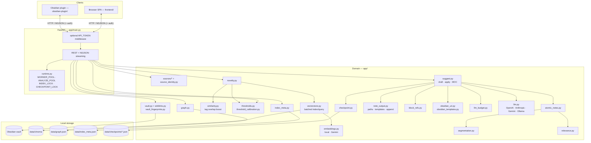
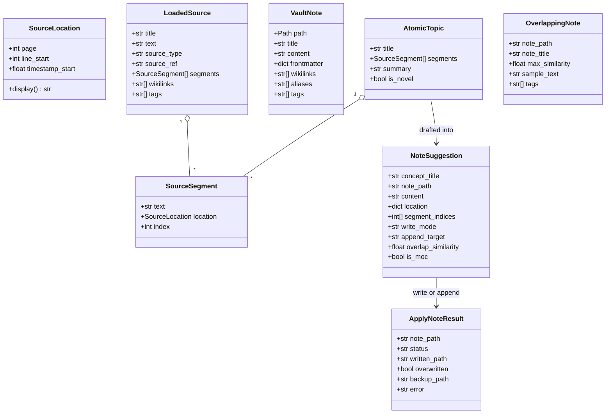
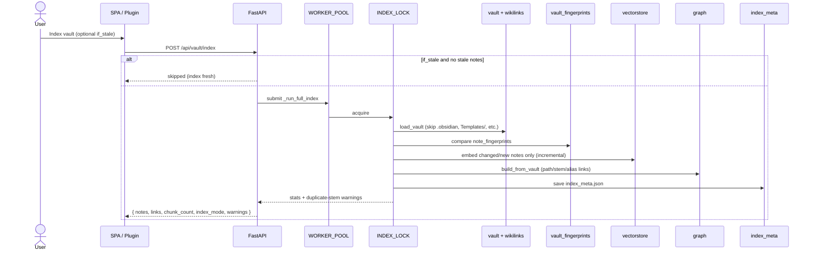
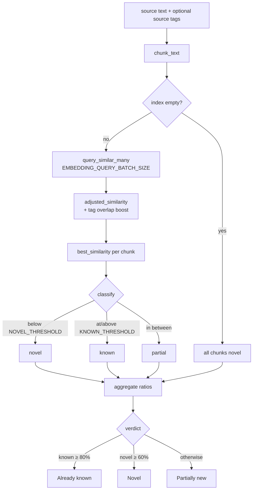
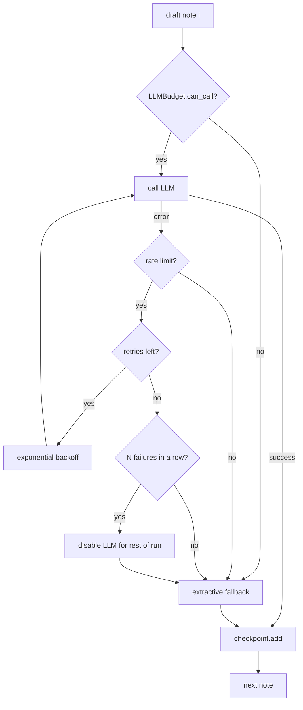

# Architecture Overview

Knowledge Database Actualizer decides whether a knowledge source (YouTube video,
PDF, text, or markdown) adds **new** information relative to an Obsidian-style
markdown vault, and then drafts **atomic, checkable** notes for the concepts it
finds. This document describes the system as implemented today: core hardening
(security, concurrency, batched similarity, checkpoints, CI) plus **Obsidian
improvement Phases 1–4** (vault fidelity, workflow fit, editor integration, and
quality/intelligence).

> Diagrams below use [Mermaid](https://mermaid.js.org/); they render on GitHub
> and in Obsidian/most markdown viewers.

---

## 1. High-level components



**Design intent:** a single-user, local-first web app. Embeddings and drafting
can run fully offline (local MiniLM + extractive summaries, or Ollama). Cloud
LLM/embedding providers are optional. Heavy work runs off the event loop;
writes are safe-by-default; the vector index stays in sync after apply.

---

## 2. Technology stack

| Layer | Choice | Notes |
|-------|--------|-------|
| Backend | Python 3.10+, **FastAPI** + Uvicorn | Async HTTP; sync pipelines on worker pools |
| Frontend | Vanilla JS SPA, Tailwind (CDN), vis-network | No build step; auth token in `sessionStorage` |
| Obsidian client | Community plugin (`main.js`) | Commands + sidebar; same API as SPA |
| Embeddings | **sentence-transformers** *or* **google-genai** | Lazy load; batched queries; retries |
| Vector store | **ChromaDB** (persistent) | Collection per provider+model; batched upsert |
| Graph | **networkx** `DiGraph` | Path/stem/alias wikilink resolution |
| Sources | `pypdf`, `pdfplumber`, `youtube-transcript-api` / `yt-dlp`, frontmatter | Tables/figures via pdfplumber; md tags/wikilinks |
| Frontmatter write | **PyYAML** `safe_dump` | No unsafe dump of user/LLM text |
| LLM (optional) | OpenAI / Anthropic / Gemini / **Ollama** (`local` alias) | Off by default; per-run budget |
| Tests / CI | **pytest** (102 tests) + GitHub Actions | Hermetic `tests/`; optional `scripts/smoke_test.py` |

---

## 3. Module map

```
app/
├── main.py                 FastAPI app, auth middleware, NDJSON stream, apply refresh
├── config.py               Pydantic settings (.env); validated thresholds / budgets
├── env_sync.py             Generate / merge .env.example from Settings
├── runtime.py              INDEX_LOCK, CHECKPOINT_LOCK, WORKER_POOL, ANALYZE_POOL
├── index_meta.py           data/index_meta.json, stale_note_count, health warnings
├── thresholds.py           Recommended novelty bands per embedding provider
├── threshold_calibration.py  Vault-specific threshold suggestions from chunk samples
├── similarity.py           Tag-overlap similarity boost for novelty scoring
├── source_identity.py      Stable source keys (youtube:<id>, posix paths)
├── wikilinks.py            Obsidian path/stem/alias resolution (+ ambiguity)
├── obsidian_uri.py           obsidian://open URI builder
├── obsidian_templates.py     Read .obsidian/app.json template folder; Templater tags
├── note_output.py            Note paths, templates, append body, topic overlap match
├── block_refs.py             Optional ^block-id injection on write
├── vault_fingerprints.py     Per-note content hashes for incremental index
├── sources/
│   ├── base.py               LoadedSource (+ wikilinks, tags), SourceSegment, SourceLocation
│   ├── __init__.py           SourceDispatcher
│   ├── pdf.py                PdfLoader (page segments + tables when enabled)
│   ├── text.py               TextLoader (strips frontmatter; extracts wikilinks/tags)
│   └── youtube.py            YouTubeLoader (canonical watch URL)
├── vault.py                  load_vault / load_note; tags, aliases, embeds; rich embedding text
├── chunking.py               Heading-aware overlapping chunks
├── embeddings.py             EmbeddingService + Local/Gemini backends (+ retry)
├── vectorstore.py            Batched index + query_similar_many (+ tag boost, sample_chunks)
├── graph.py                  KnowledgeGraph; upsert_notes after apply
├── novelty.py                Batched scoring → verdict; overlapping note tags
├── segmentation.py           Bounded planning units
├── relevance.py              Boilerplate / ToC / link-dump filters
├── media.py                  Tables & figure captions → notes
├── atomic_notes.py           Topic planning (structural + optional LLM); segment scoring
├── summarize.py              Extractive fallback drafting helpers
├── suggest.py                Draft loop, MOC, overwrite-safe apply (write/append)
├── llm.py                    Providers + rate-limit retry helpers
├── llm_budget.py             Per-run call / input-char caps
├── prompts.py                Centralized prompts
├── text_utils.py / text_limits.py
└── checkpoint.py             Incremental note persistence; resume matching

frontend/                   index.html + app.js (SPA)
obsidian-plugin/            manifest.json, main.js, styles.css (thin API client)
tests/                      Hermetic unit tests (fake embeddings; 102 tests)
scripts/smoke_test.py       Optional integration (real MiniLM)
.github/workflows/ci.yml
```

| Concern | Modules |
|---------|---------|
| Ingestion | `sources`, `source_identity`, `vault`, `wikilinks`, `chunking` |
| Retrieval & judgement | `embeddings`, `vectorstore`, `similarity`, `novelty`, `thresholds`, `threshold_calibration`, `index_meta`, `vault_fingerprints` |
| Note generation | `segmentation`, `relevance`, `media`, `atomic_notes`, `summarize`, `note_output`, `suggest`, `llm`, `llm_budget` |
| Obsidian integration | `obsidian_uri`, `obsidian_templates`, `note_output`, `block_refs`, `wikilinks` |
| Concurrency & durability | `runtime`, `checkpoint` |
| Visualization | `graph` |

---

## 4. Core data model



`SourceLocation` makes notes **checkable** (PDF page, text lines, YouTube
timestamps). It survives segmentation and is written into YAML + a `## Source`
section.

Checkpoint resume identity uses `normalize_source_key()` so YouTube URL variants
(`youtu.be/…` vs `watch?v=…`) match as `youtube:<video_id>`.

Uploaded markdown sources preserve frontmatter-derived **tags** and **wikilinks**
for overlap display and tag-aware similarity.

---

## 5. Pipeline A — Vault indexing



Notes:
- Malformed YAML frontmatter is tolerated (block dropped, body kept).
- **Incremental index:** `vault_fingerprints.py` hashes note content plus
  chunk/embedding/rich-embedding settings; unchanged notes are skipped.
- **Rich embeddings** (`RICH_NOTE_EMBEDDINGS`): indexed chunk text prepends
  title, aliases, and `#tags` before body — improves retrieval when wording
  differs but topic matches.
- Chroma metadata stores `note_path`, `note_title`, `heading`, comma-separated
  `tags`, and chunk text.
- Chroma collection name is suffixed with `provider_model` so model switches do
  not mix vector spaces.
- Ambiguous bare `[[Note]]` stems (same basename in two folders) do **not**
  resolve; use `[[folder/Note]]`. Duplicates are reported on index.
- `/api/status` reports `stale_note_count`, index health warnings, threshold
  hints, and `thresholds.calibration_available` when enough chunks exist.

---

## 6. Pipeline B — Analyze & draft (streaming)

```mermaid
sequenceDiagram
    actor User
    participant SPA as SPA / Plugin
    participant API as FastAPI
    participant Pool as ANALYZE_POOL + queue
    participant S as sources + identity
    participant N as novelty + similarity
    participant SG as suggest + budget
    participant L as llm
    participant CK as checkpoint

    User->>SPA: Analyze (optional resume=true)
    SPA->>API: POST /api/sources/analyze (NDJSON)
    Note over SPA,API: SPA may prompt re-index when stale_note_count > 0
    API->>Pool: run pipeline; push events to queue
    Pool->>S: load → LoadedSource (+ tags, wikilinks)
    alt resume mismatch
        Pool-->>SPA: error (checkpoint untouched)
    else fresh analyze with incomplete checkpoint
        Pool-->>SPA: warning (will replace)
        Pool->>CK: start()
    end
    Pool->>N: analyze_novelty (batched; source_tags boost)
    Pool->>SG: iter_note_suggestions
    loop topics
        SG->>SG: score segments (tag-aware)
        SG->>SG: plan topics; infer append_target if overlap ≥ KNOWN
        SG->>L: draft (if budget + provider allow)
        alt rate limited
            SG-->>SPA: waiting / retry
        else budget exhausted / no LLM
            SG->>SG: extractive fallback + template
        end
        SG->>CK: save note (CHECKPOINT_LOCK)
        SG-->>SPA: progress drafting
    end
    opt generate_moc and enough notes
        SG->>SG: append MOC index note (deselected by default)
    end
    Pool-->>SPA: result (novelty, suggestions, graph, tag overlap)
    User->>SPA: Write selected (write or append mode)
    SPA->>API: apply-batch (overwrite flag, mode per note)
    API->>API: write/append + optional ^block-id + .bak on overwrite
    API->>API: upsert_notes (Chroma + graph)
    API-->>SPA: results + index_refresh
```

The HTTP response is **NDJSON**. Analyze work runs in a **worker thread** on
`ANALYZE_POOL` (long drafting runs do not starve index/apply on `WORKER_POOL`).
If the client disconnects mid-run, the consumer sets a cancellation event and
the worker stops — notes drafted so far stay in the checkpoint. Uploads larger
than `MAX_UPLOAD_MB` are rejected with `413` before any work starts. Index
mutations and queries take `INDEX_LOCK`.

### Streamed event types

| `type` | Fields | Meaning |
|--------|--------|---------|
| `progress` | `stage`, `current`, `total`, `message` | loading · novelty · scoring · drafting |
| `warning` | `message` | Non-fatal (budget, rate-limit, replace checkpoint, …) |
| `result` | `source`, `novelty`, `suggestions`, `warnings`, `graph` | Final payload (+ wikilinks, tags, obsidian URIs on overlaps) |
| `error` | `message`, `partial_suggestions` | Fatal; notes already checkpointed remain |

---

## 7. Note-generation internals

```mermaid
flowchart LR
    A["source.segments"] --> B{"filter_boilerplate?"}
    B -->|yes| C["relevance.filter_relevant_segments"]
    B -->|no| D
    C --> D["segmentation.split_large_segments"]
    D --> E["score units vs vault<br/>batched + tag boost"]
    E --> F["plan_atomic_topics"]
    F --> G["structural split"]
    F --> H["LLM plan if budget allows"]
    G --> I{"enough LLM topics?"}
    H --> I
    I -->|yes| J["LLM topics"]
    I -->|no| K["structural topics"]
    J --> L["drop boilerplate titles<br/>+ MAX_NOTES_PER_SOURCE"]
    K --> L
    L --> M["draft each topic<br/>LLMBudget gates complete()"]
    M --> N["frontmatter + template<br/>+ Related + Source"]
    N --> O["append_target if overlap<br/>topic_overlap_match"]
    O --> P["checkpoint.add()"]
    P --> Q{"MOC enabled?"}
    Q -->|yes| R["optional index.md MOC"]
```



- **Segmentation** turns large units (e.g. full PDF pages) into bounded planning
  units (`SEGMENT_TARGET_CHARS`).
- **Planning** prefers structural coverage; LLM plans are accepted only when they
  yield enough distinct topics.
- **Output paths** default to `{NOTE_OUTPUT_FOLDER}/{source-slug}/{concept}.md`.
- **Templates:** `NOTE_TEMPLATE_PATH` or vault `.obsidian/app.json` template
  folder (`USE_OBSIDIAN_TEMPLATES`); placeholders `{{body}}`, `{{title}}`,
  `{{concept}}`, `{{tags}}`, Templater-style tags.
- **Append workflow:** when a topic matches an existing note above
  `KNOWN_THRESHOLD`, `append_target` is set; the SPA can preview via
  `GET /api/vault/note` and apply with `mode=append`.
- **MOC:** when `GENERATE_MOC=true` and enough concept notes exist, an
  `{source}/index.md` map-of-content is proposed (deselected by default).
- **Budget** caps LLM spend; remaining notes fall back to extractive summaries.
- Embedding / LLM **rate limits** use shared retry helpers; exhausted embedding
  queries yield **unknown** similarity (not forced-novel).

---

## 8. Novelty judgement



`novelty_score = mean(1 − best_similarity)` (higher = more novel).

**Tag-aware boost** (`similarity.py`): when source tags overlap vault note tags
stored in Chroma metadata, similarity is increased (capped at 1.0) before
threshold classification — reducing false “Novel” when vocabulary differs but
topic tags align. Knobs: `TAG_SIMILARITY_ENABLED`, `TAG_SIMILARITY_BOOST_PER_TAG`,
`TAG_SIMILARITY_MAX_BOOST`.

**Threshold assistant** (`threshold_calibration.py`): samples indexed chunks,
compares same-note vs cross-note similarities, and suggests `NOVEL_THRESHOLD` /
`KNOWN_THRESHOLD`. Exposed at `GET /api/vault/thresholds/calibrate`; the SPA
offers a **Calibrate thresholds** button when the index is large enough.

Recommended starting thresholds (`thresholds.py` / README):

| Embedding provider | `NOVEL_THRESHOLD` | `KNOWN_THRESHOLD` |
|--------------------|-------------------|-------------------|
| `local` (MiniLM)   | 0.55              | 0.75              |
| `gemini`           | 0.65              | 0.82              |

Config validates `0 ≤ novel < known ≤ 1` and `CHUNK_OVERLAP < CHUNK_SIZE` at
startup. The app refuses to start when `CHUNK_SIZE` exceeds the embedding
model's input window — otherwise similarity would silently use truncated chunks.
Changing chunk/embedding/rich-embedding settings after indexing surfaces a
re-index warning via `index_meta`.

---

## 9. Resilience: rate limits, budget, checkpointing



- Each note is written to `data/checkpoints/<source-key>.json` via temp-file + rename
  under `CHECKPOINT_LOCK`. A manifest tracks incomplete runs for `/api/status`.
- **Resume mismatch** (different source key) **aborts** without calling
  `checkpoint.start()` — saved notes are never wiped by a wrong Continue.
- Fresh Analyze of a **different** source leaves other sources' checkpoints intact.
- Resume matches planned topics to saved notes by
  `(segment_indices, composed title)` and only drafts gaps.
- Knobs: `LLM_MAX_RETRIES`, `LLM_RETRY_*`, `LLM_DISABLE_AFTER_FAILURES`,
  `LLM_MAX_CALLS_PER_RUN`, `LLM_MAX_INPUT_CHARS_PER_RUN` (`0` = unlimited).

---

## 10. Write safety & index freshness

| Rule | Behavior |
|------|----------|
| Default write | Skip if target exists (`overwrite=false`) |
| Overwrite | Requires `overwrite=true`; writes sibling `*.md.bak` |
| Append | `mode=append` merges body under existing note (or creates if missing) |
| Block refs | When `INCLUDE_BLOCK_IDS=true`, `block_refs.py` appends `^id` to bullets/lines on write |
| Batch apply | Per-note `results`, `skipped_existing`, `errors` — one failure does not abort the rest |
| Frontmatter | `yaml.safe_dump` only |
| Path guard | Writes confined to configured vault (no traversal) |
| After apply | `vector_store.upsert_notes` + `graph.upsert_notes`; response includes `index_refresh` |

---

## 11. Auth and local-web security

The SPA is served **same-origin** from this app — there is **no CORS middleware**.
Browsers therefore refuse cross-origin reads and preflighted API calls from other
websites.

**Host allowlist (`ALLOWED_HOSTS`):** every request's `Host` header must match
the comma-separated allowlist (default `localhost,127.0.0.1,[::1]`). Requests
with a foreign host get `400` (DNS-rebinding guard).

**Optional API token (`API_TOKEN`):** when set:

- `/api/*` requires `Authorization: Bearer <token>` **or** `X-API-Token: <token>`
- comparison uses constant-time `secrets.compare_digest`
- `/` and `/static/*` stay public (SPA shell)
- `/api/status` reports `auth_required: true`
- the SPA and Obsidian plugin prompt on `401` and store the token for the session

Unset `API_TOKEN` → open local use (default).

---

## 12. HTTP API surface

| Method & path | Purpose |
|---------------|---------|
| `GET /api/status` | Config, index/graph sizes, LLM/embedding info, budgets, `stale_note_count`, `warnings`, `auth_required`, Obsidian URI flags, `thresholds.calibration_available` |
| `POST /api/vault/index` | Incremental re-index + graph + `index_meta` (`if_stale` skips when fresh) |
| `GET /api/vault/note` | Read existing note content (append diff preview) |
| `GET /api/vault/thresholds/calibrate` | Suggest novelty thresholds from indexed chunk samples |
| `GET /api/vault/graph` | Vis-network JSON (optional highlight) |
| `POST /api/sources/analyze` | NDJSON: novelty + suggestions (`resume` optional) |
| `GET /api/suggestions/checkpoint` | Last run's saved notes |
| `POST /api/suggestions/apply` | One note; `overwrite`, `mode` (`write`/`append`); then incremental re-index |
| `POST /api/suggestions/apply-batch` | Many notes; per-note results + `index_refresh` |
| `GET /`, `/static/*` | SPA |

Analyze `result` payloads include overlapping notes with **tags** and optional
**obsidian_uri** (when `OBSIDIAN_VAULT_NAME` is set), source **wikilink**
resolution, and **tag overlap** for the UI.

---

## 13. Configuration reference

Settings load from `.env` via `app/config.py` (see `.env.example`, generated by
`scripts/env_sync.py`). Defaults: local MiniLM, LLM **off**, safe thresholds.

| Group | Keys |
|-------|------|
| Vault / data | `VAULT_PATH`, `DATA_DIR` |
| Embeddings | `EMBEDDING_PROVIDER`, `EMBEDDING_MODEL`, `EMBEDDING_API_KEY` |
| Batches | `EMBEDDING_QUERY_BATCH_SIZE`, `CHROMA_INDEX_BATCH_SIZE` |
| Novelty | `NOVEL_THRESHOLD`, `KNOWN_THRESHOLD` |
| Chunking | `CHUNK_SIZE`, `CHUNK_OVERLAP` |
| Note shaping | `MAX_NOTE_LINES`, `MAX_NOTES_PER_SOURCE`, `ATOMIC_NOTE_*`, `SEGMENT_TARGET_CHARS` |
| Note output | `NOTE_OUTPUT_FOLDER`, `NOTE_TEMPLATE_PATH`, `NOTE_FRONTMATTER_TYPE`, `NOTE_FRONTMATTER_STATUS`, `DEFAULT_NOTE_TAGS`, `GENERATE_MOC`, `MOC_MIN_NOTES` |
| Obsidian | `OBSIDIAN_VAULT_NAME`, `USE_OBSIDIAN_TEMPLATES`, `OBSIDIAN_TEMPLATE_NAME` |
| Quality / intelligence | `RICH_NOTE_EMBEDDINGS`, `TAG_SIMILARITY_*`, `THRESHOLD_CALIBRATION_SAMPLES`, `INCLUDE_BLOCK_IDS` |
| Filtering / media | `FILTER_BOILERPLATE`, `INCLUDE_MEDIA` |
| LLM | `LLM_PROVIDER`, `LLM_API_KEY`, `LLM_MODEL`, `OLLAMA_BASE_URL` |
| Budget | `LLM_MAX_CALLS_PER_RUN`, `LLM_MAX_INPUT_CHARS_PER_RUN` |
| Rate limits | `LLM_MAX_RETRIES`, `LLM_RETRY_*`, `LLM_DISABLE_AFTER_FAILURES` |
| Auth | `API_TOKEN` |
| Local-web security | `ALLOWED_HOSTS` |

`text_limits.py` holds finer constants (preview lengths, planning excerpts).

---

## 14. Persistence layout

```
data/
├── chroma/                 ChromaDB (per provider+model collection)
├── graph.json              cached wikilink graph
├── index_meta.json         last index: vault path, embedding model, note fingerprints
└── checkpoints/
    ├── manifest.json       incomplete / recent runs (for /api/status)
    └── <source-key>.json   one checkpoint file per source

<vault>/
├── sources/<source-slug>/<concept-slug>.md   default output (NOTE_OUTPUT_FOLDER)
├── sources/<source-slug>/index.md          optional MOC
├── Templates/                              skipped during indexing
└── …/*.md.bak                              backup kept on overwrite
```

`data/` is git-ignored.

---

## 15. Obsidian integration

| Feature | Where | Notes |
|---------|-------|-------|
| Tags & embeds in index | `vault.py`, `vectorstore.py` | Frontmatter tags; `![[…]]` parsed like wikilinks |
| Path-qualified wikilinks | `wikilinks.py`, `suggest.py` | Related notes use `[[folder/Note]]` when needed |
| Open in Obsidian | `obsidian_uri.py`, SPA overlap UI | Requires `OBSIDIAN_VAULT_NAME` |
| Vault templates | `obsidian_templates.py`, `note_output.py` | Reads `.obsidian/app.json` template folder |
| Obsidian plugin | `obsidian-plugin/` | Analyze, index, sidebar write — see plugin README |
| Block references | `block_refs.py` | Optional `^block-id` on apply when enabled |

---

## 16. Testing & CI

| Suite | Role |
|-------|------|
| `pytest tests/` | 102 hermetic unit tests (fake embedding backend; no HF download) |
| `scripts/smoke_test.py` | Optional integration against real MiniLM + sample vault |
| `.github/workflows/ci.yml` | Install deps, run `pytest tests/` on Python 3.10 & 3.12 |

Pinned runtime deps live in `requirements.txt` / `pyproject.toml`;
`requirements-dev.txt` adds pytest + httpx.

---

## 17. Extension points

- **New source type:** `SourceLoader` under `app/sources/` emitting
  `SourceSegment`s; register in `SourceDispatcher`; extend
  `normalize_source_key` if resume identity needs it.
- **New embedding/LLM provider:** `EmbeddingBackend` / `LLMProvider` + factory
  wiring (`get_embedding_service` / `get_llm_provider`).
- **Tuning volume/cost:** `SEGMENT_TARGET_CHARS`, `MAX_NOTES_PER_SOURCE`,
  atomic limits, and LLM budget caps.
- **Similarity tuning:** tag boost knobs, threshold calibration sample size, or
  provider defaults in `thresholds.py`.
- **Prompt changes:** `app/prompts.py`.

---

## 18. Request lifecycle summary

1. **Index** vault (worker + lock) → incremental batched embeddings in Chroma +
   resolved wikilink graph + `index_meta` fingerprints.
2. **Analyze** source → load & identity key → tag-aware novelty (batched queries)
   → plan topics → draft under budget/retry → stream NDJSON → checkpoint each
   note → optional MOC.
3. **Review** suggestions in the SPA or plugin (paginated, editable, write vs
   append, append preview).
4. **Apply** selected notes with overwrite guards → optional block refs → `.bak`
   on replace → incremental Chroma + graph refresh.

---

## 19. Implementation phases (summary)

### Core hardening (foundation)

| Focus | Outcome |
|-------|---------|
| Security & write safety | No hardcoded keys; LLM off by default; safe YAML; overwrite + `.bak`; path guard; batch apply per-note results |
| Concurrency & index freshness | Worker pools + locks; post-apply re-index; `index_meta` + stale detection; threshold/chunk validation |
| Similarity & cost | `query_similar_many`; embedding retries → unknown not forced-novel; `LLMBudget` |
| Quality bar | pytest suite, pinned deps, GitHub Actions CI, Ollama/`local` LLM, optional `API_TOKEN` |

### Obsidian improvement Phases 1–4

| Phase | Focus | Outcome |
|-------|--------|---------|
| 1 — Obsidian fidelity | Tags, embeds, wikilinks | Tag metadata in Chroma; path-qualified related links; tag overlap in UI |
| 2 — Workflow fit | Output paths, append, MOC | `note_output.py`; write/append modes; stale index prompt; MOC index notes |
| 3 — Obsidian integration | URI, templates, plugin | `obsidian://open` links; vault template discovery; Obsidian community plugin |
| 4 — Quality & intelligence | Embeddings, tags, thresholds | Rich note embeddings; tag-aware similarity; threshold calibration; optional block refs |
| 5 — Quality & cost (Phase E) | Batch draft, append headings, multi-vault | `LLM_DRAFT_BATCH_SIZE`; heading-targeted append (`append_heading`, `Note#Section`); extended Templater normalization; optional per-vault Chroma collections via `MULTI_VAULT_INDEX_ENABLED` |
